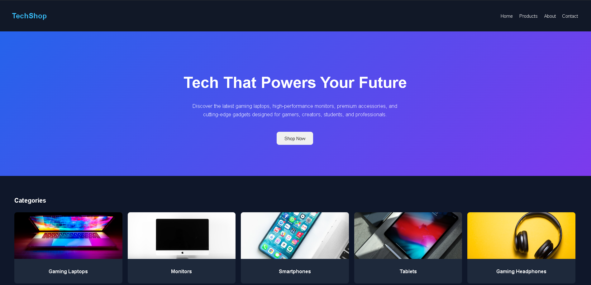
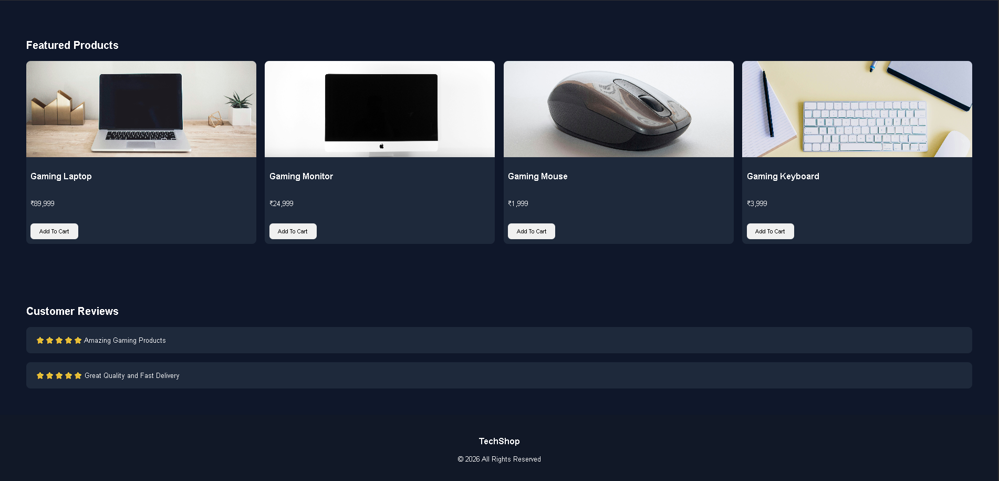
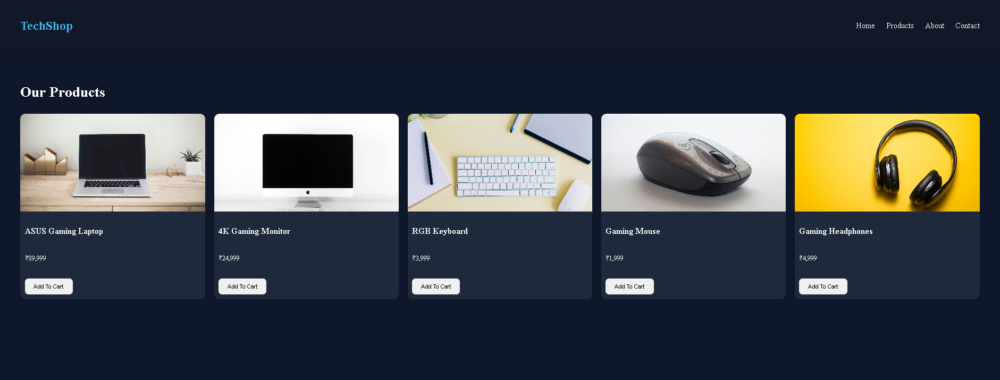
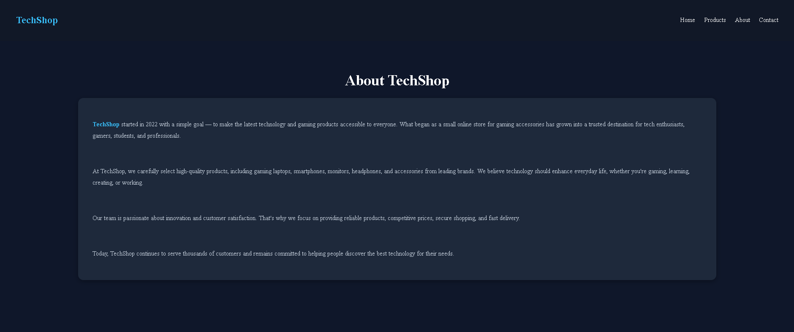
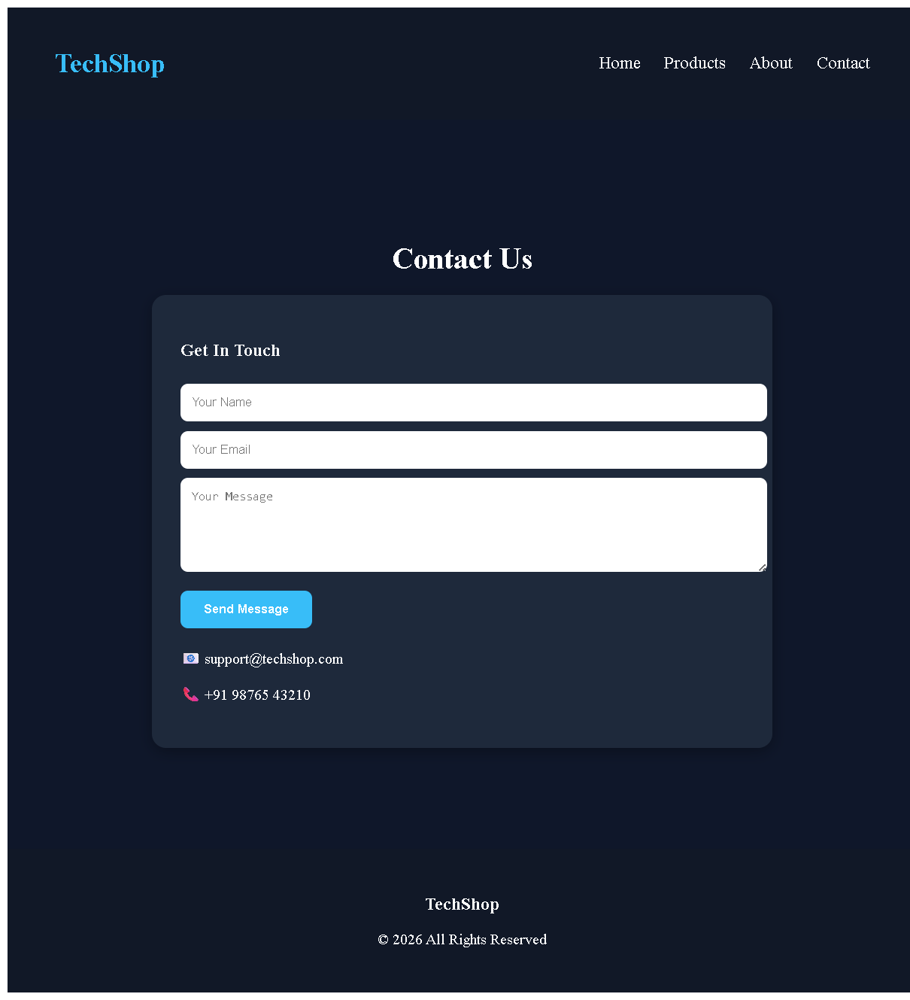

# 🚀 TechShop - React E-Commerce Website

## 📌 Project Overview

TechShop is a modern React-based E-Commerce Website UI designed for technology enthusiasts and gamers. The project showcases premium electronic products including gaming laptops, monitors, keyboards, mice, and headphones.

This project was created using React and React Router with a focus on modern UI design and component-based architecture.

---

## 🛠 Technologies Used

* React JS
* React Router DOM
* JavaScript (ES6+)
* CSS3
* Vite

---

## ✨ Features

### Home Page

* Modern Navigation Bar
* Hero Section
* Product Categories
* Featured Products
* Customer Testimonials
* Shopping Cart Preview
* Footer

### Product Categories

* Gaming Laptops
* Monitors
* Smartphones
* Tablets
* Gaming Headphones

### Additional Pages

* Products Page
* About Page
* Contact Page

---

## 📂 Project Structure

```text
src
│
├── components
│   ├── Navbar.jsx
│   ├── Hero.jsx
│   ├── Categories.jsx
│   ├── ProductCard.jsx
│   ├── Testimonials.jsx
│   ├── CartPreview.jsx
│   ├── WhyChooseUs.jsx
│   └── Footer.jsx
│
├── pages
│   ├── Home.jsx
│   ├── Products.jsx
│   ├── About.jsx
│   └── Contact.jsx
│
├── App.jsx
├── main.jsx
└── index.css
```

---

## 📸 Screenshots

### Home Page





---
### Product Page




### About Page



---

### Contact Page



---


## 🎯 Learning Outcomes

* React Components
* Props
* React Router
* Component Reusability
* Responsive Layout Design
* Modern UI Development

---

## 👨‍💻 Author

Atharva Patole

---

## 📄 License

This project is created for educational purposes.
